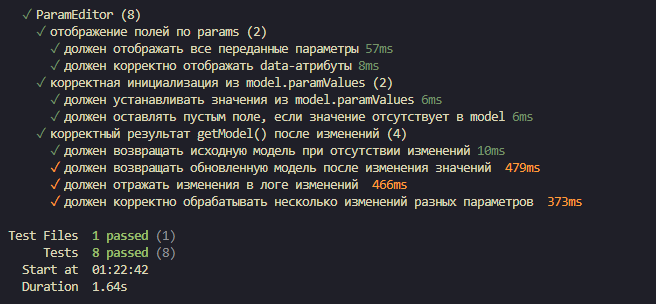

📜 Доступные скрипты

В проекте доступны следующие npm-скрипты:

🚀 npm run dev
Запускает проект в режиме разработки с использованием Vite.

🧪 Тестирование (Vitest)
npm run test
Запускает Vitest в интерактивном режиме.

🖥 npm run test:ui
Запускает Vitest с графическим интерфейсом в браузере.

▶ npm run test:run
Одноразовый запуск всех тестов без watch-режима.

📊 npm run test:coverage
Запускает тесты и формирует отчёт о покрытии кода тестами.

